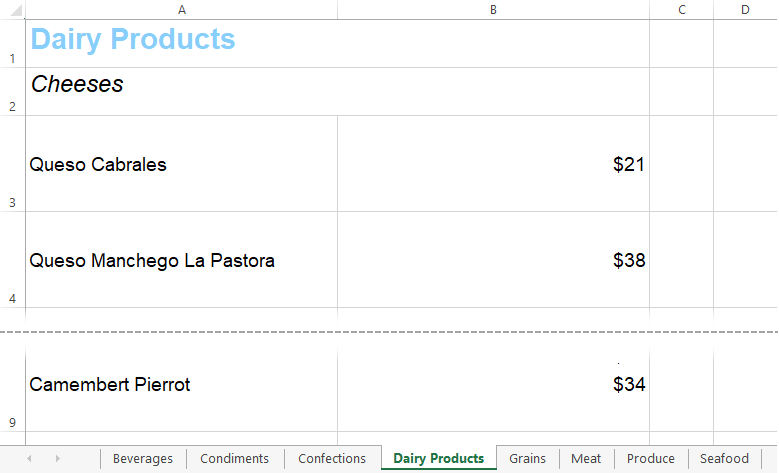
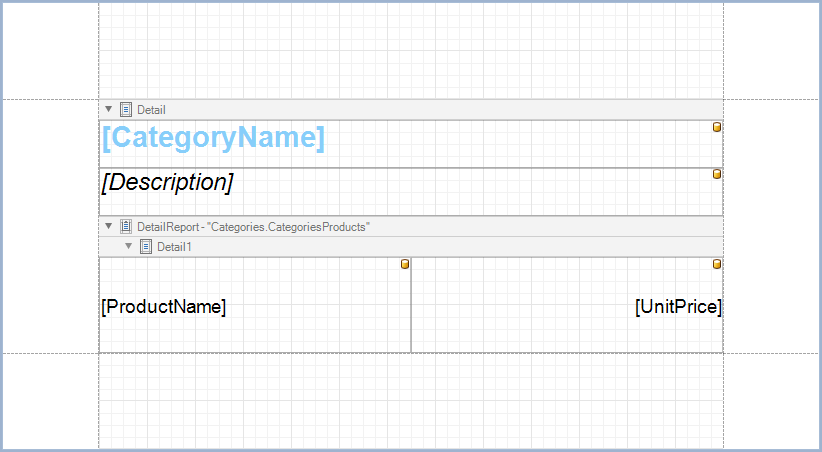

<!-- default badges list -->

<!-- default badges end -->
# Export a Report's Detail Sections to Separate Excel Sheets

This example demonstrates how to export detail sections of a master-detail report to separate Excel sheets.

The report contains information about product categories. The name and description of each category are bound to the controls in the
[Detail](https://docs.devexpress.com/XtraReports/DevExpress.XtraReports.UI.DetailBand) band. The name and price of each product are
bound to the controls in the [DetailReport](https://docs.devexpress.com/XtraReports/DevExpress.XtraReports.UI.DetailReportBand) band.

On **Print Preview**, product categories span across one or two report pages. To export each product category to a separate sheet of an Excel file, do the following:

1. Set the **DetaiReport** band's [PageBreak](https://docs.devexpress.com/XtraReports/DevExpress.XtraReports.UI.Band.PageBreak) property to **AfterBand** to print each product category on a new report page.
2. Set the report's [RollPaper](https://docs.devexpress.com/XtraReports/DevExpress.XtraReports.UI.XtraReport.RollPaper) property to **true** to fit each product category to one report page.
3. Set the [ExportMode](https://docs.devexpress.com/CoreLibraries/DevExpress.XtraPrinting.XlsxExportMode) property to **Single File Page By Page** to export each page of the report to a separate Excel sheet.
4. (Optional) Use the [XlSheetCreated](https://docs.devexpress.com/CoreLibraries/DevExpress.XtraPrinting.PrintingSystemBase.XlSheetCreated) event to change the default name of each sheet to the category name.

## Files to Review

* [Form1.cs](CS/reporting-example-export/Form1.cs) (VB: [Form1.vb](VB/reporting-example-export/Form1.vb))

* [XtraReport1.cs](CS/reporting-example-export/XtraReport1.cs) (VB: [XtraReport1.vb](VB/reporting-example-export/XtraReport1.vb))

## Documentation

* [Export to XLSX](https://docs.devexpress.com/XtraReports/6284)
* [Export to XLS](https://docs.devexpress.com/XtraReports/2579)

## More Examples

- [Reporting for WinForms - How to Use MailKit to Send a Report as a Document in PDF](https://github.com/DevExpress-Examples/reporting-winforms-mailkit-email-report-pdf)

<!-- feedback -->
## Does this example address your development requirements/objectives?

 

(you will be redirected to DevExpress.com to submit your response)
<!-- feedback end -->
